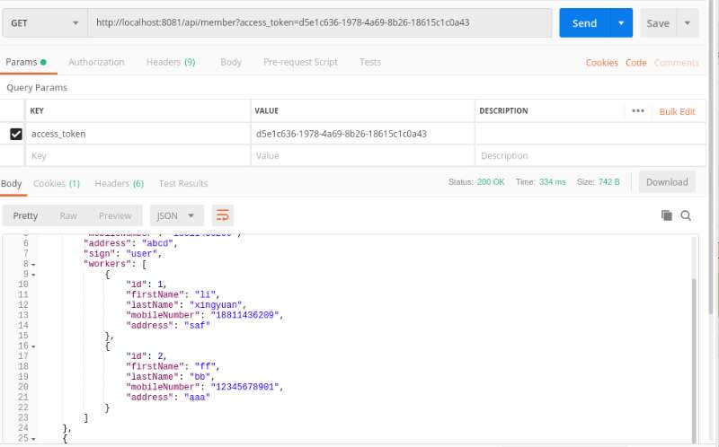
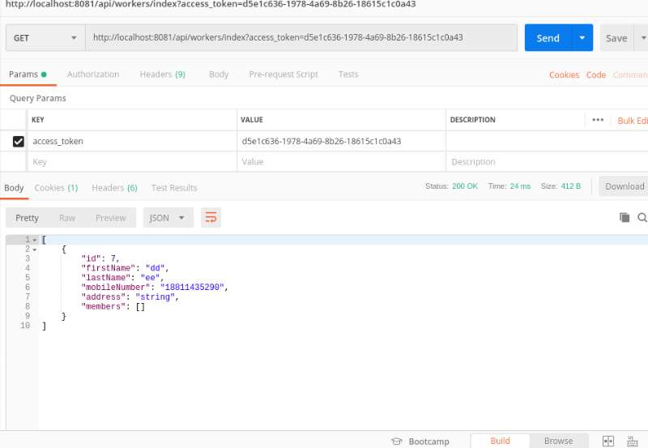
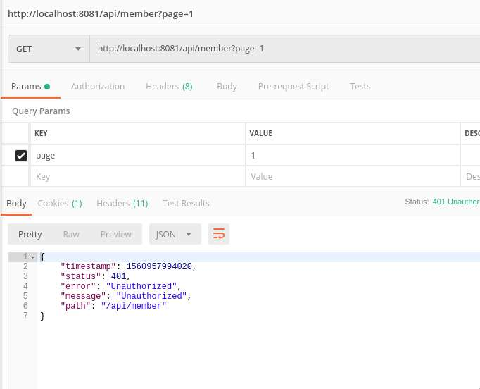

# Readme

##Group Members
16301095 李星原
16301099 莫日根呼


第一次作业<https://github.com/mrgh97/sport-club-1>

第二次作业<https://github.com/mrgh97/sport-club-2>

 第三次作业 <https://github.com/lixingyuan1998/sportclub_3>

第四次作业<https://github.com/lixingyuan1998/sportclub_4>

springcloud 练习 <https://github.com/lixingyuan1998/springcloud_test>


GymHandler

```java
private final GymService gymService;
public GymHandler(GymService gymService) {
    this.gymService = gymService;
}
public Mono<ServerResponse> findById(ServerRequest request) {
    String id = request.pathVariable("id");
    return ok()
            .contentType(MediaType.APPLICATION_JSON)
            .body(GymService.findById(id), Gym.class);
}
public Mono<ServerResponse> findAll(ServerRequest request) {
    return ok()
            .contentType(MediaType.APPLICATION_JSON)
            .body(GymService.findAll(), Gym.class);
}
public Mono<ServerResponse> save(ServerRequest request) {
    final Mono<Gym> Gym = request.bodyToMono(Gym.class);
    return ok()
            .contentType(MediaType.APPLICATION_JSON)
            .body(fromPublisher(Gym.flatMap(gymService::save), Gym.class));
}
public Mono<ServerResponse> delete(ServerRequest request) {
    String id = request.pathVariable("id");
    return ok()
            .contentType(MediaType.APPLICATION_JSON)
            .body(gymService.deleteById(id), Void.class);
}
```

GymRouter

```java
@Bean
public RouterFunction<ServerResponse> route(GymHandler handler) {
    return RouterFunctions
            .route(GET("/api/gym").and(accept(MediaType.APPLICATION_JSON)), handler::findAll)
            .andRoute(GET("/api/gym/{id}").and(accept(MediaType.APPLICATION_STREAM_JSON)), handler::findById)
            .andRoute(POST("/api/gym").and(accept(MediaType.APPLICATION_JSON)), handler::save)
            .andRoute(DELETE("/api/gym/{id}").and(accept(MediaType.APPLICATION_JSON)), handler::delete);
}
```

GymServiceImpl

```java
@Service
public class GymServiceImpl implements GymService {
    private GymRepository gymRepository;
    public GymServiceImpl(GymRepository gymRepository) {
        this.gymRepository = gymRepository;
    }
    @Override
    public Mono<Gym> findById(String id) {
        return gymRepository.findById(id);
    }
    @Override
    public Flux<Gym> findAll() {
        return gymRepository.findAll();
    }
    @Override
    public Mono<Gym> save(Gym gym) {
        return gymRepository.save(gym);
    }
    @Override
    public Mono<Void> deleteById(String id) {
        return gymRepository.deleteById(id);
    }
}
```

GymRepository

```java
public interface GymRepository extends ReactiveMongoRepository<Gym, String> {

}
```

MemberHandler

```java
public class MemberHandler {
    private final MemberService memberService;
    public MemberHandler(GymService gymService)
    {
        this.memberService = memberService;
    }
    public Mono<ServerResponse> findById(ServerRequest request) {
        String id = request.pathVariable("id");
        return ok()
                .contentType(MediaType.APPLICATION_JSON)
                .body(memberService.findById(id), Gym.class);
    }
    public Mono<ServerResponse> findAll(ServerRequest request) {
        return ok()
                .contentType(MediaType.APPLICATION_JSON)
                .body(memberService.findAll(), Gym.class);
    }
    public Mono<ServerResponse> save(ServerRequest request) {
        final Mono<Gym> Gym = request.bodyToMono(Gym.class);
        return ok()
                .contentType(MediaType.APPLICATION_JSON)
                .body(fromPublisher(Gym.flatMap(memberService::save), Gym.class));
    }
    public Mono<ServerResponse> delete(ServerRequest request) {
        String id = request.pathVariable("id");
        return ok()
                .contentType(MediaType.APPLICATION_JSON)
                .body(memberService.deleteById(id), Void.class);
    }
```

MemberEouter

```java
public class MemberRouter {
    @Bean
    public RouterFunction<ServerResponse> route(GymHandler handler) {
        return RouterFunctions
                .route(GET("/api/member").and(accept(MediaType.APPLICATION_JSON)), handler::findAll)
                .andRoute(GET("/api/member/{id}").and(accept(MediaType.APPLICATION_STREAM_JSON)), handler::findById)
                .andRoute(POST("/api/member").and(accept(MediaType.APPLICATION_JSON)), handler::save)
                .andRoute(DELETE("/api/member/{id}").and(accept(MediaType.APPLICATION_JSON)), handler::delete);
    }
}
```



WorkerHandler

```java
public class WorkerHandler {
    private final WorkerService workerService;
    public WorkerHandler(WorkerService workerService) {
        this.workerService = workerService;
    }
    public Mono<ServerResponse> findById(ServerRequest request) {
        String id = request.pathVariable("id");
        return ok()
                .contentType(MediaType.APPLICATION_JSON)
                .body(workerService.findById(id), Gym.class);
    }
    public Mono<ServerResponse> findAll(ServerRequest request) {
        return ok()
                .contentType(MediaType.APPLICATION_JSON)
                .body(workerService.findAll(), Gym.class);
    }
    public Mono<ServerResponse> save(ServerRequest request) {
        final Mono<Gym> Gym = request.bodyToMono(Gym.class);
        return ok()
                .contentType(MediaType.APPLICATION_JSON)
                .body(fromPublisher(Gym.flatMap(workerService::save), Gym.class));
    }
    public Mono<ServerResponse> delete(ServerRequest request) {
        String id = request.pathVariable("id");
        return ok()
                .contentType(MediaType.APPLICATION_JSON)
                .body(workerService.deleteById(id), Void.class);
    }
}
```

WorkerRouter

```
public class WorkerRouter {
    @Bean
    public RouterFunction<ServerResponse> route(GymHandler handler) {
        return RouterFunctions
                .route(GET("/api/workers/index").and(accept(MediaType.APPLICATION_JSON)), handler::findAll)
                .andRoute(GET("/api/workers/view/{id}").and(accept(MediaType.APPLICATION_STREAM_JSON)), handler::findById)
                .andRoute(POST("/api/workers/add").and(accept(MediaType.APPLICATION_JSON)), handler::save)
                .andRoute(DELETE("/api/workers/delete/{id}").and(accept(MediaType.APPLICATION_JSON)), handler::delete);
    }
}
```



启动mongodb


配置mongo

```java
<dependency>
   <groupId>de.flapdoodle.embed</groupId>
   <artifactId>de.flapdoodle.embed.mongo</artifactId>
</dependency>
```

```java
<dependency>
   <groupId>org.springframework.boot</groupId>
   <artifactId>spring-boot-starter-data-mongodb-reactive</artifactId>
</dependency>
```


## Authentication oauth2

流程：


Application.yml关于oauth2配置:

```java
spring:
      security:
        oauth2:
          client:
            client-id: client
            client-secret: secret
            access-token-uri: http://localhost:8081/oauth/token
            user-authorization-uri: http://localhost:8081/oauth/authorize
          resource:
            token-info-uri: http://localhost:8081/oauth/check_token
```

使用Jpa查询member表中对象，然后通过角色role进行权限分配：




